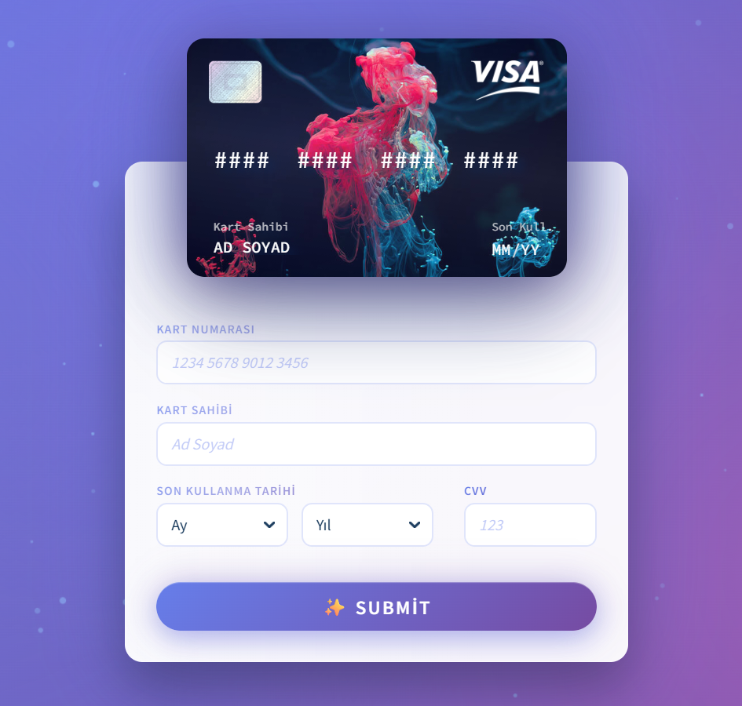

# SCAN – Kredi Kartı Vol.1

Bu proje, modern tasarım trendlerine uygun olarak hazırlanmış bir kart bilgileri giriş ekranı UI tasarımıdır.
Amacı; ödeme ekranları, checkout sayfaları veya finansal uygulamalar için kullanıcı dostu bir arayüz örneği sunmaktır.

##⚠️ Not:
Bu proje sadece arayüz (UI) tasarımıdır.
Herhangi bir backend, ödeme altyapısı, gerçek kart doğrulaması veya veri saklama işlemi yapılmaz.

---
## ✨ Özellikler

- Modern ve minimal tasarım
- Kart önizleme (Visa mockup)
-K art numarası, kart sahibi, son kullanma tarihi ve CVV alanları
- Responsive yapıya uygun UI
- Demo ve portföy amaçlı kullanım için ideal

## 🧰 Kullanılan Teknolojiler

- HTML / CSS
- JavaScript

## 🚀 Kullanım Amacı

Bu proje:

- UI/UX portföyünde sergilemek
- Frontend pratikleri yapmak
- Ödeme ekranı tasarımı örneği göstermek
amacıyla hazırlanmıştır.

Gerçek projelerde kullanmadan önce mutlaka backend entegrasyonu ve güvenlik önlemleri eklenmelidir.

---

---
## ⚠️ Yasal Uyarı
Bu projede kullanılan kart görselleri ve bilgiler tamamen örnektir.
Gerçek kart bilgileriyle kullanılmamalıdır.

##✍️ Geliştirici
Serhat Can
UI/UX Designer - Oyun & Uygulama Geliştiricisi
